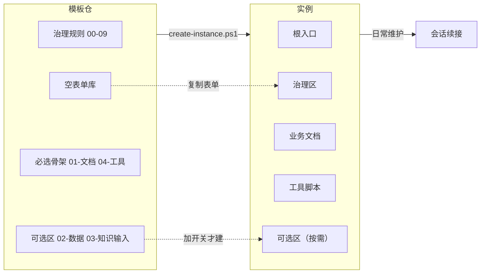

# 工作区管理模板说明（_workspace-template）

> 版本：v1.1　|　模板仓：独立 git 仓　|　设计原则：**复制即用**——模板包顶层结构 = 实例骨架。

## 一分钟看懂（总览）

**这是什么**：一份「复制即用」的工作区骨架。拷贝一份 → 填几个占位符 → 就是一个新工作区。模板只规定**怎么管理文档**（规则、索引、续接），不规定**管理什么**（业务目录由实例自己定）。



**一句话工作流**：模板仓（一套通用规则）→ `create-instance.ps1` 复制 → 新实例（默认 3 个目录）→ 按 `05-落地检查清单.md` 走 4 个阶段 → 日常通过 `_handoff/` 续接进度 → 模板更新用 `sync-template.ps1` 回流。

**谁读什么**：
- **新用户 / 想先理解全貌**：本文件的「一分钟看懂」→ `_workspace/00-总入口.md`。
- **要建一个新工作区**：看下面「创建实例」。
- **要维护模板本身**：看「同步模板更新」与「版本管理」。

## 模板结构（顶层 = 实例骨架）

| 路径 | 复制到新实例后的作用 |
|---|---|
| `README.md` / `AGENTS.md` / `CLAUDE.md` | 实例根入口（人类 / Codex / Claude） |
| `_workspace/` | **治理区**：全局规则（00-09）、空表单库 `_表单/`、实例参考 `_参考示例/`、`AGENTS.md` 入口、落地清单、.gitignore、续接模板 |
| `01-文档/` `04-工具/` | 业务目录骨架（**必选**，README + AGENTS） |
| `02-数据/` `03-知识输入/` | **可选区**（**默认不建**，加 `-IncludeOptionalZones` 一并创建；README + AGENTS） |
| `模板-工作区.code-workspace` | VS Code 打开入口（改名为 `<实例名>.code-workspace`） |
| `模板说明.md` `CHANGELOG.md` `sync-template.ps1` `create-instance.ps1` | **模板仓自身文件，不复制到实例** |

> 关于三个入口文件的通俗解释：`README.md` 给人看（这个工作区装了什么）；`AGENTS.md` 给 Codex 看；`CLAUDE.md` 给 Claude Code 看——两者都 `@` 导入 `_workspace/00-总入口.md`，让 AI 从任意子目录启动都能被引导到全局规则。

## 创建实例（三选一）

### 方式 A：一键脚本（推荐）

```powershell
# 核心骨架（_workspace + 01-文档 + 04-工具）
& <模板仓>\create-instance.ps1 -Name <实例名> [-Parent <父目录>]

# 含可选区（+ 02-数据 + 03-知识输入）
& <模板仓>\create-instance.ps1 -Name <实例名> -IncludeOptionalZones
```

自动复制骨架（排除模板自身文件）并生成 `<实例名>.code-workspace`。

### 方式 B：手动复制

1. 复制整个模板仓目录 → 改名 `<实例名>/`（或 `git clone` 远端后复制）。
2. 删除模板自身文件：`模板说明.md`、`CHANGELOG.md`、`sync-template.ps1`、`create-instance.ps1`、根 `.gitignore`、`.git`。
3. `模板-工作区.code-workspace` 改名 `<实例名>.code-workspace`。
4. 按 `_workspace/05-落地检查清单.md` 走阶段 1-4（git init / 填目录索引 / 首提交）。

### 方式 C：AI 辅助

在目标父目录启动 AI CLI，发指令：「按 `<模板仓路径>` 的模板说明创建实例 `<实例名>`」。AI 读本说明后执行方式 A。

## 同步模板更新到已建实例

```powershell
& sync-template.ps1 -Instance <实例目录>          # dry-run：只报告差异
& sync-template.ps1 -Instance <实例目录> -Apply    # 应用 auto 文件（模板权威）
```

- `sync: auto`（可安全覆盖，模板权威）：`06-AI执行环境.md`、`05-落地检查清单.md`、`_handoff/_模板-续接文档.md`、`08-通用文档管理原则.md`、`09-工具管理.md`、`_表单/_模板-数据源登记表.md`、`_表单/_模板-需求文档雏形.md`。
- `sync: manual`（实例化文件，需人工合并）：目录索引 / 跨目录约束 / git 管理 / README / AGENTS / 业务骨架 / 参考示例等。
- 挂载登记（`_workspace/07-VSCode工作区挂载登记.md`，sync: manual）与同步脚本（`04-工具/sync-vscode-workspace.ps1`，.ps1 不参与 sync 扫描）由 create-instance 复制进实例；脚本为推导式默认路径，放实例 `04-工具\` 下即可直接运行。

## 版本管理

- 版本号 `v<主>.<次>`，历史见 `CHANGELOG.md`。
- 模板文件头部 front-matter：`<!-- 模板 vX.Y | sync: auto/manual | target: <实例路径> -->`。
- 修改模板后：升版本号 + 登记 CHANGELOG + commit。